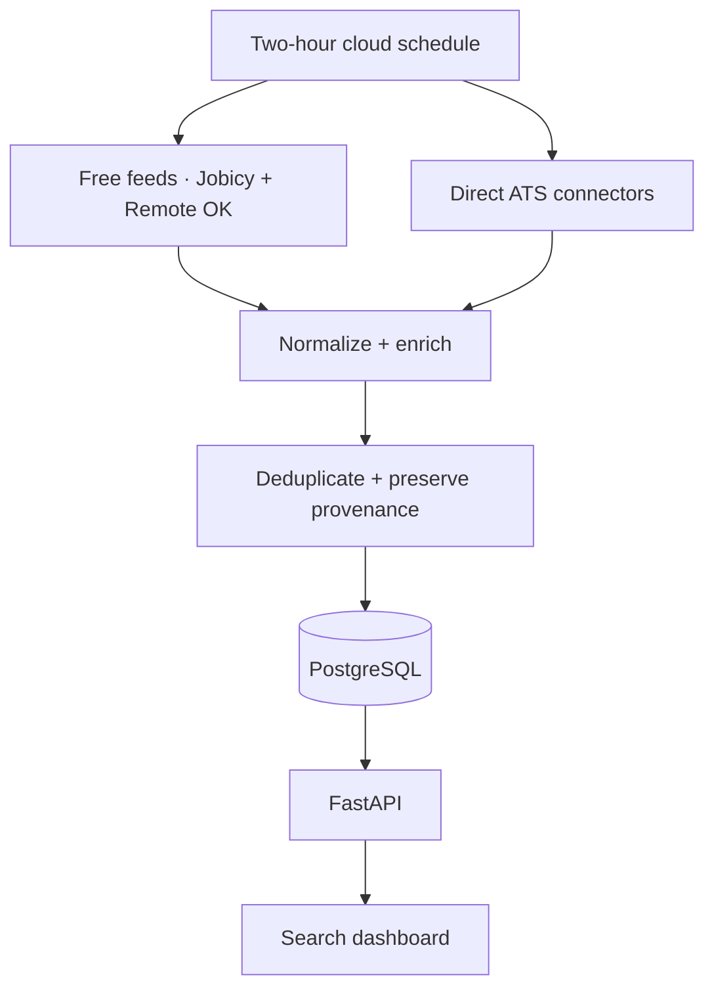

# JobSignal — U.S. Jobs Aggregator

JobSignal pulls newly posted U.S. jobs into one normalized, deduplicated feed. A fresh clone runs
with keyless public feeds, while direct ATS connectors add company-career-site coverage at no
charge. Every job records its source and distinguishes a verified publication time from the time
this system first discovered it.

The included dashboard, REST API, PostgreSQL storage, Docker setup, cloud blueprint, and
two-hour GitHub Actions schedule make this a complete deployable service rather than a collection
of scraper scripts.

## What is included

- Keyless Jobicy feeds for U.S.-eligible remote engineering and data-science roles.
- Keyless Remote OK feed with source attribution and technical-role filtering.
- Direct Greenhouse, Lever, Ashby, SmartRecruiters, and configurable Workday tenant connectors.
- Optional TheirStack connector for users who later want a paid breadth layer.
- A canonical job schema with salary, location, workplace type, experience, visa language,
  skills, timestamps, original URL, apply URL, ATS, and complete source provenance.
- URL-first and conservative fuzzy deduplication that preserves every underlying source record.
- Per-source checkpoints with a five-minute overlap, avoiding unnecessary repeat retrieval while
  remaining resilient to clock skew.
- Exact U.S. and rolling freshness filters. “Posted in 24h” excludes jobs whose true publication
  time is unknown.
- Deterministic role categorization and profile-fit scoring with no LLM/API cost.
- FastAPI endpoints, generated OpenAPI documentation, responsive dashboard, health check,
  protected manual sync, Docker Compose, tests, and CI.
- Unattended cloud ingestion every 120 minutes, plus a GitHub Actions trigger every two hours.

There is no free, official API that returns every LinkedIn, Indeed, Glassdoor, Workday, or iCIMS
job. Free ATS endpoints are company-scoped, so broad free coverage grows by adding company board
identifiers to `config/sources.yaml`. JobSignal intentionally avoids brittle login bypasses and
unsupported scraping.

## Architecture



## Canonical job record

```json
{
  "id": "f753b95c-88a5-4718-a22a-7bf8a30fe6f8",
  "title": "AI Engineer",
  "company": "Example Inc",
  "location": "New York, NY",
  "city": "New York",
  "state": "NY",
  "country_code": "US",
  "remote": false,
  "workplace_type": "hybrid",
  "category": "AI / ML",
  "skills": ["Python", "LLM", "RAG", "AWS"],
  "experience_min": 2,
  "salary_min": 130000,
  "salary_max": 170000,
  "salary_currency": "USD",
  "salary_period": "year",
  "posted_at": "2026-09-01T15:21:00Z",
  "posted_at_confidence": "source_posted_at",
  "first_seen_at": "2026-09-01T15:27:14Z",
  "apply_url": "https://example.com/jobs/ai-engineer/apply",
  "original_url": "https://example.com/jobs/ai-engineer",
  "ats": "greenhouse",
  "primary_provider": "jobicy",
  "fit_score": 85,
  "fit_reasons": ["Title matches AI Engineer", "4 matching skills"],
  "is_active": true,
  "sources": []
}
```

## Run locally

Requirements: Python 3.11+ or Docker.

```bash
git clone https://github.com/varunjose/JobsAggregator.git
cd JobsAggregator
cp .env.example .env
```

No data-provider key is required. For a production deployment, set a strong `ADMIN_API_KEY` in
`.env`; `THEIRSTACK_API_KEY` can remain blank. Then choose one path:

```bash
# Python
python -m venv .venv
source .venv/bin/activate
pip install -e ".[dev]"
python -m app.cli sync
uvicorn app.main:app --reload

# Or Docker + PostgreSQL
docker compose up --build
```

Open [http://localhost:8000](http://localhost:8000). API documentation is available at
[http://localhost:8000/docs](http://localhost:8000/docs).

## Configure sources

The default configuration enables three keyless feeds: Jobicy engineering, Jobicy data science,
and a technical-role subset of Remote OK. Both providers' canonical URLs are retained, and Remote
OK is visibly identified as the source as required by its API terms. The two-hour schedule is
within Jobicy's published rule not to poll more frequently than hourly.

Direct connectors are defined in [`config/sources.yaml`](config/sources.yaml). Enable only boards
you want to check independently:

```yaml
sources:
  - type: greenhouse
    enabled: true
    company: Acme
    token: acme

  - type: ashby
    enabled: true
    company: Example AI
    board: ExampleAI

  - type: workday
    enabled: true
    company: Example Bank
    host: example.wd1.myworkdayjobs.com
    tenant: example
    site: External_Careers
```

Greenhouse only exposes `updated_at`, not a guaranteed publication timestamp. JobSignal stores it
as `source_updated_at` and leaves `posted_at` empty. Lever `createdAt`, Ashby `publishedAt`,
SmartRecruiters `releasedDate`, Workday `postedOn`, and TheirStack `date_posted` are retained with
an explicit confidence label.

### Free-source coverage

| Source | Cost | Setup | Coverage constraint |
| --- | --- | --- | --- |
| Jobicy | Free, no key | Enabled by default | Remote jobs; latest 200 per configured filter |
| Remote OK | Free, no key | Enabled by default | Remote feed; must retain attribution/link |
| Greenhouse | Free public GET | One board token per company | No global company search |
| Lever | Free public GET | One site token per company | No global full-text search |
| Ashby | Free public GET | One board name per company | No global company search |
| SmartRecruiters | Free public postings | One company identifier | Company-scoped |
| Workday | Free public career endpoint | Host, tenant, and site per company | No global Workday endpoint |
| TheirStack | Optional paid service | API key | Broader indexed-market coverage |

LinkedIn and Indeed expose partner APIs for publishing/syncing jobs, not an unrestricted free API
for reading their entire searchable job inventory. The supported free route is to ingest the
underlying employer ATS posting whenever its public endpoint is available.

## Cloud deployment and the required two-hour run

The repository contains [`render.yaml`](render.yaml), which creates a web service and persistent
PostgreSQL database. The application scheduler is configured for 120 minutes and performs an
initial sync after deployment.

1. In Render, create a **Blueprint** from this repository.
2. Deploy; the free feeds require no provider secrets. Confirm `/health` returns
   `{"status":"ok"}`.
3. Copy the generated `ADMIN_API_KEY` and deployed URL.
4. In GitHub → repository **Settings → Secrets and variables → Actions**, add:
   - `JOBS_AGGREGATOR_URL` — for example `https://jobs-aggregator-web.onrender.com`
   - `JOBS_AGGREGATOR_ADMIN_API_KEY` — the same Render admin key
5. Run **Two-hour cloud sync** once from the Actions tab. Its cron is `17 */2 * * *` (UTC).

The app's scheduler and GitHub workflow both use a non-overlapping process lock. For a
multi-instance deployment, turn off the in-process scheduler with
`SYNC_SCHEDULER_ENABLED=false` and retain the GitHub Actions trigger or use one provider-native
cron worker.

## API

| Method | Endpoint | Purpose |
| --- | --- | --- |
| `GET` | `/api/jobs` | Search and filter normalized active jobs |
| `GET` | `/api/jobs/{id}` | Full job plus source provenance |
| `GET` | `/api/stats` | Fresh-job, company, remote, and fit totals |
| `GET` | `/api/sources` | Connector configuration and latest status |
| `GET` | `/api/sync/runs` | Recent ingestion runs and counters |
| `POST` | `/api/sync` | Start a sync; requires `X-Admin-Key` in production |
| `GET` | `/health` | Deployment health check |

Useful examples:

```bash
# Verified jobs posted within the last 24 hours
curl "http://localhost:8000/api/jobs?hours=24&freshness=posted&sort=newest"

# Newly posted or newly discovered remote AI/ML jobs with a fit score of 70+
curl "http://localhost:8000/api/jobs?category=AI%20%2F%20ML&remote=true&min_fit=70&freshness=either"

# Protected manual sync
curl -X POST -H "X-Admin-Key: $JOBS_ADMIN_KEY" http://localhost:8000/api/sync
```

## Commands

```bash
python -m app.cli sources            # Show enabled connectors
python -m app.cli sync               # Run all enabled connectors
python -m app.cli sync --source ashby
python -m app.cli status             # Database freshness totals
pytest
ruff check .
```

## Adding another portal

Create a connector in `app/connectors/` that subclasses `BaseConnector`, emits
`NormalizedJob`, and register it in `app/connectors/__init__.py`. The sync service will then apply
U.S. filtering, enrichment, deduplication, provenance tracking, active/closed state, and run
metrics automatically.

Respect each source's terms, rate limits, robots rules, and data-retention requirements. Prefer an
official API or licensed aggregate feed over scraping rendered pages.

## License

MIT
