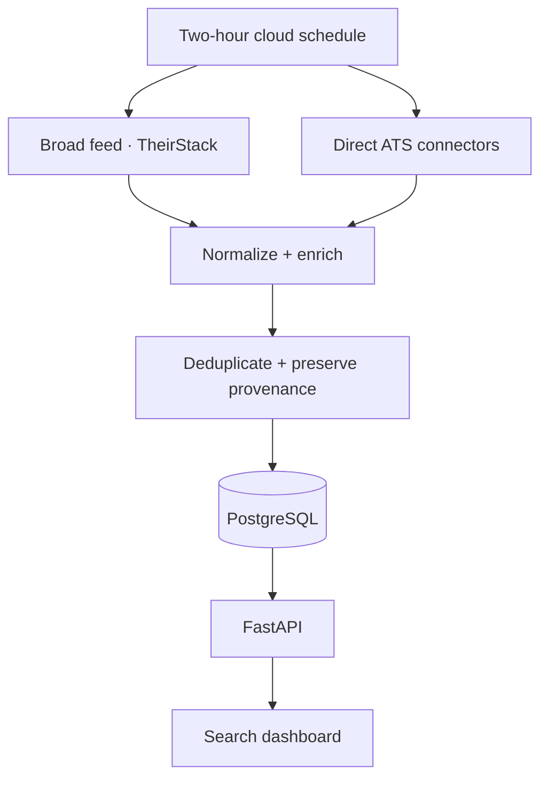

# JobSignal — U.S. Jobs Aggregator

JobSignal pulls newly posted U.S. jobs into one normalized, deduplicated feed. It combines a
broad-market provider with direct ATS connectors, records exactly where every job came from,
and distinguishes a verified publication time from the time this system first discovered a job.

The included dashboard, REST API, PostgreSQL storage, Docker setup, cloud blueprint, and
two-hour GitHub Actions schedule make this a complete deployable service rather than a collection
of scraper scripts.

## What is included

- TheirStack broad-market connector for Workday, iCIMS, Oracle, Greenhouse, Lever, Ashby,
  SmartRecruiters, company career sites, and other indexed sources.
- Direct Greenhouse, Lever, Ashby, SmartRecruiters, and configurable Workday tenant connectors.
- A canonical job schema with salary, location, workplace type, experience, visa language,
  skills, timestamps, original URL, apply URL, ATS, and complete source provenance.
- URL-first and conservative fuzzy deduplication that preserves every underlying source record.
- Exact U.S. and rolling freshness filters. “Posted in 24h” excludes jobs whose true publication
  time is unknown.
- Deterministic role categorization and profile-fit scoring with no LLM/API cost.
- FastAPI endpoints, generated OpenAPI documentation, responsive dashboard, health check,
  protected manual sync, Docker Compose, tests, and CI.
- Unattended cloud ingestion every 120 minutes, plus a GitHub Actions trigger every two hours.

No data vendor can provide a literal census of every U.S. opening. This project treats TheirStack
as the breadth layer and direct connectors as speed/verification layers, which is the scalable
way to cover many ATS products without maintaining dozens of brittle global scrapers.

## Architecture



## Canonical job record

```json
{
  "id": "f753b95c-88a5-4718-a22a-7bf8a30fe6f8",
  "title": "AI Engineer",
  "company": "Example Inc",
  "location": "New York, NY",
  "city": "New York",
  "state": "NY",
  "country_code": "US",
  "remote": false,
  "workplace_type": "hybrid",
  "category": "AI / ML",
  "skills": ["Python", "LLM", "RAG", "AWS"],
  "experience_min": 2,
  "salary_min": 130000,
  "salary_max": 170000,
  "salary_currency": "USD",
  "salary_period": "year",
  "posted_at": "2026-09-01T15:21:00Z",
  "posted_at_confidence": "source_posted_at",
  "first_seen_at": "2026-09-01T15:27:14Z",
  "apply_url": "https://example.com/jobs/ai-engineer/apply",
  "original_url": "https://example.com/jobs/ai-engineer",
  "ats": "greenhouse",
  "primary_provider": "theirstack",
  "fit_score": 85,
  "fit_reasons": ["Title matches AI Engineer", "4 matching skills"],
  "is_active": true,
  "sources": []
}
```

## Run locally

Requirements: Python 3.11+ or Docker.

```bash
git clone https://github.com/varunjose/JobsAggregator.git
cd JobsAggregator
cp .env.example .env
```

Add a TheirStack API key to `.env`:

```dotenv
THEIRSTACK_API_KEY=your-key
ADMIN_API_KEY=use-a-long-random-value
```

Then choose one path:

```bash
# Python
python -m venv .venv
source .venv/bin/activate
pip install -e ".[dev]"
python -m app.cli sync
uvicorn app.main:app --reload

# Or Docker + PostgreSQL
docker compose up --build
```

Open [http://localhost:8000](http://localhost:8000). API documentation is available at
[http://localhost:8000/docs](http://localhost:8000/docs).

## Configure sources

TheirStack is automatically enabled when `THEIRSTACK_API_KEY` exists. It searches U.S. jobs from
the configured target-title families and fetches only the recent window before applying an exact
local timestamp cutoff.

Direct connectors are defined in [`config/sources.yaml`](config/sources.yaml). Enable only boards
you want to check independently:

```yaml
sources:
  - type: greenhouse
    enabled: true
    company: Acme
    token: acme

  - type: ashby
    enabled: true
    company: Example AI
    board: ExampleAI

  - type: workday
    enabled: true
    company: Example Bank
    host: example.wd1.myworkdayjobs.com
    tenant: example
    site: External_Careers
```

Greenhouse only exposes `updated_at`, not a guaranteed publication timestamp. JobSignal stores it
as `source_updated_at` and leaves `posted_at` empty. Lever `createdAt`, Ashby `publishedAt`,
SmartRecruiters `releasedDate`, Workday `postedOn`, and TheirStack `date_posted` are retained with
an explicit confidence label.

## Cloud deployment and the required two-hour run

The repository contains [`render.yaml`](render.yaml), which creates a web service and persistent
PostgreSQL database. The application scheduler is configured for 120 minutes and performs an
initial sync after deployment.

1. In Render, create a **Blueprint** from this repository.
2. Enter `THEIRSTACK_API_KEY` when prompted.
3. Deploy, then confirm `/health` returns `{"status":"ok"}`.
4. Copy the generated `ADMIN_API_KEY` and deployed URL.
5. In GitHub → repository **Settings → Secrets and variables → Actions**, add:
   - `JOBS_AGGREGATOR_URL` — for example `https://jobs-aggregator-web.onrender.com`
   - `JOBS_AGGREGATOR_ADMIN_API_KEY` — the same Render admin key
6. Run **Two-hour cloud sync** once from the Actions tab. Its cron is `17 */2 * * *` (UTC).

The app's scheduler and GitHub workflow both use a non-overlapping process lock. For a
multi-instance deployment, turn off the in-process scheduler with
`SYNC_SCHEDULER_ENABLED=false` and retain the GitHub Actions trigger or use one provider-native
cron worker.

## API

| Method | Endpoint | Purpose |
| --- | --- | --- |
| `GET` | `/api/jobs` | Search and filter normalized active jobs |
| `GET` | `/api/jobs/{id}` | Full job plus source provenance |
| `GET` | `/api/stats` | Fresh-job, company, remote, and fit totals |
| `GET` | `/api/sources` | Connector configuration and latest status |
| `GET` | `/api/sync/runs` | Recent ingestion runs and counters |
| `POST` | `/api/sync` | Start a sync; requires `X-Admin-Key` in production |
| `GET` | `/health` | Deployment health check |

Useful examples:

```bash
# Verified jobs posted within the last 24 hours
curl "http://localhost:8000/api/jobs?hours=24&freshness=posted&sort=newest"

# Newly posted or newly discovered remote AI/ML jobs with a fit score of 70+
curl "http://localhost:8000/api/jobs?category=AI%20%2F%20ML&remote=true&min_fit=70&freshness=either"

# Protected manual sync
curl -X POST -H "X-Admin-Key: $JOBS_ADMIN_KEY" http://localhost:8000/api/sync
```

## Commands

```bash
python -m app.cli sources            # Show enabled connectors
python -m app.cli sync               # Run all enabled connectors
python -m app.cli sync --source ashby
python -m app.cli status             # Database freshness totals
pytest
ruff check .
```

## Adding another portal

Create a connector in `app/connectors/` that subclasses `BaseConnector`, emits
`NormalizedJob`, and register it in `app/connectors/__init__.py`. The sync service will then apply
U.S. filtering, enrichment, deduplication, provenance tracking, active/closed state, and run
metrics automatically.

Respect each source's terms, rate limits, robots rules, and data-retention requirements. Prefer an
official API or licensed aggregate feed over scraping rendered pages.

## License

MIT
